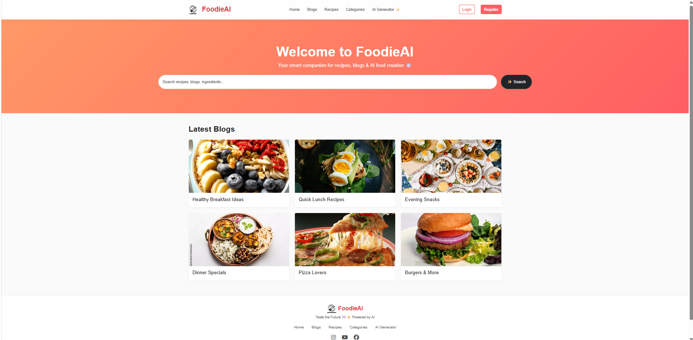
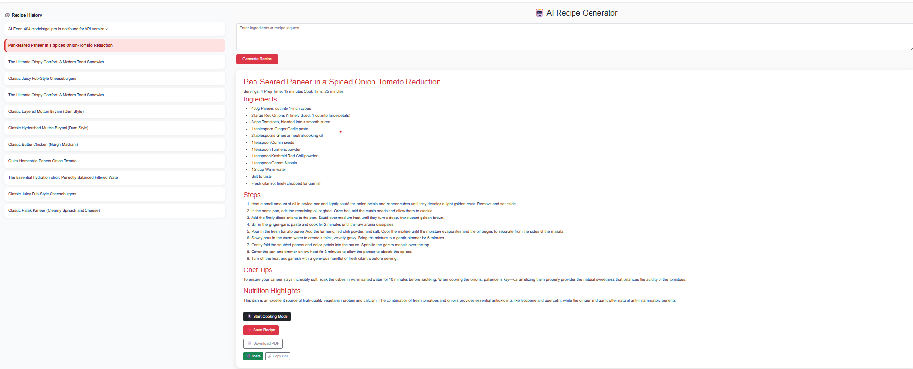

# 🍔 Food Blog AI (Flask)

An AI-powered food blog web app where users can generate recipes using ingredients.

## 🚀 Features
- User authentication
- Blog system
- AI recipe generator
- MySQL database integration

## 🛠 Tech Stack
- Backend: Flask (Python)
- Frontend: HTML, CSS, Bootstrap
- Database: MySQL

## ▶️ Run Locally
pip install -r requirements.txt  
python app.py

# 📸 Screenshots

## 🏠 Homepage

## 🤖 Recipe Generator

## 📝 Blog Page

