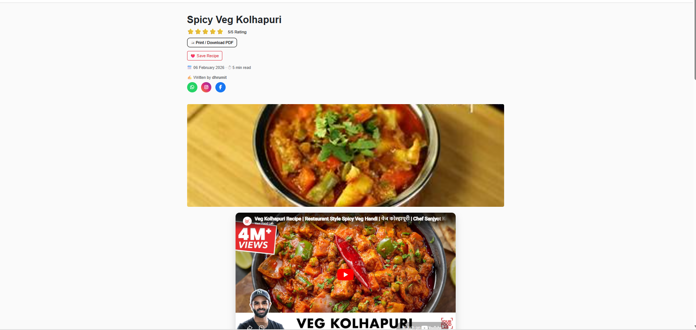
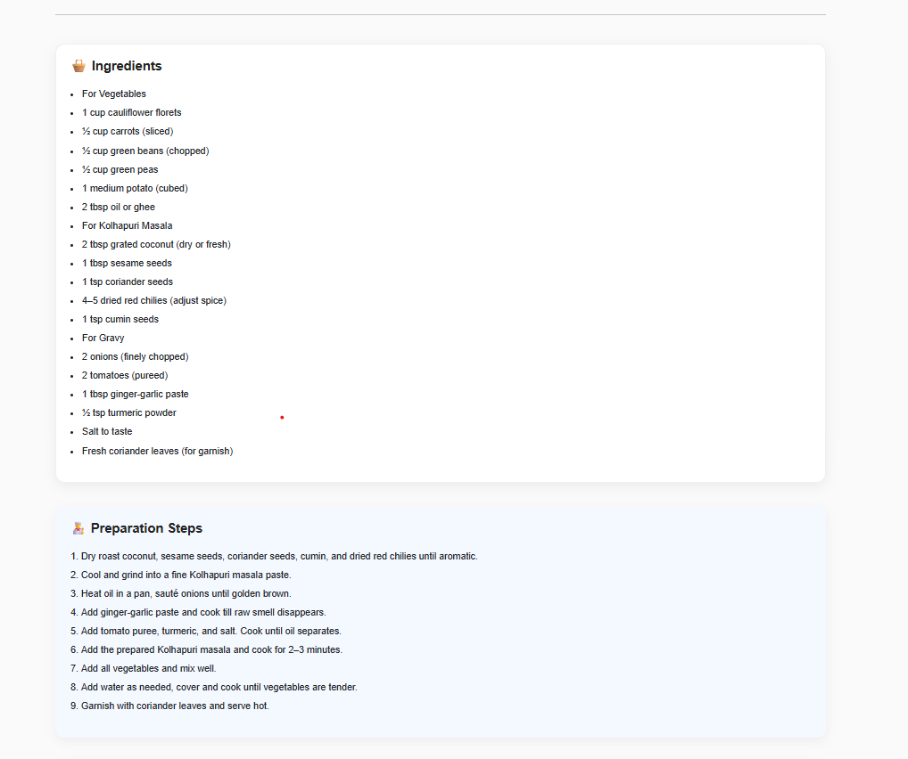
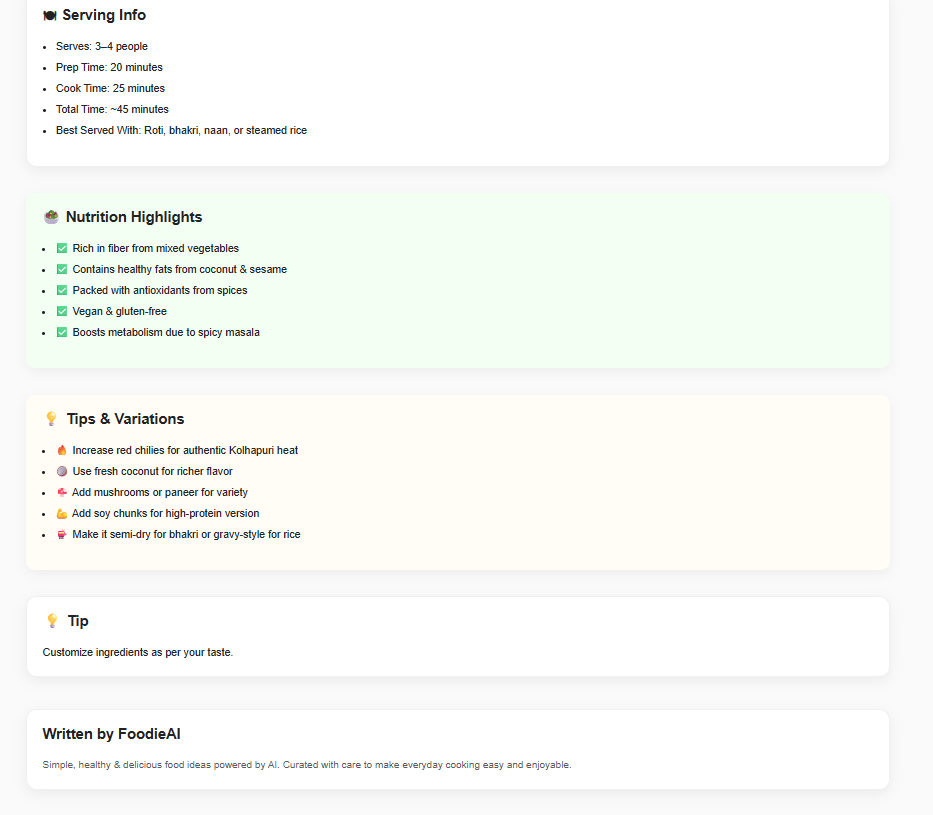

# 🍔 Food Blog AI (Flask)

An AI-powered food blog web app where users can generate recipes using ingredients.

---

## 🚀 Features
- User authentication (Login/Register)
- Blog management system
- AI-powered recipe generator 🤖
- Save and manage recipes
- MySQL database integration
- PDF export feature 📄

---

## 🤖 AI Integration

This project uses AI to generate dynamic recipes based on user input.

### 🔹 AI Features
- Generates complete recipes from ingredients
- Structured output (Ingredients, Steps, Tips, Nutrition)
- Clean HTML output for frontend rendering

### 🔹 Technology Used
- Google Gemini API
- Prompt engineering for structured responses

---

## 🛠 Tech Stack

- Backend: Flask (Python)
- Frontend: HTML, CSS, Bootstrap
- Database: MySQL
- ORM: Flask-SQLAlchemy
- Authentication: Flask-Login
- AI: Google Gemini API

---

## ▶️ Run Locally

```bash
pip install -r requirements.txt
flask run


# 📸 Screenshots

## 🏠 Homepage


## 🤖 Recipe Generator


## 📝 Blog Page


## 📝 More Blog Views


